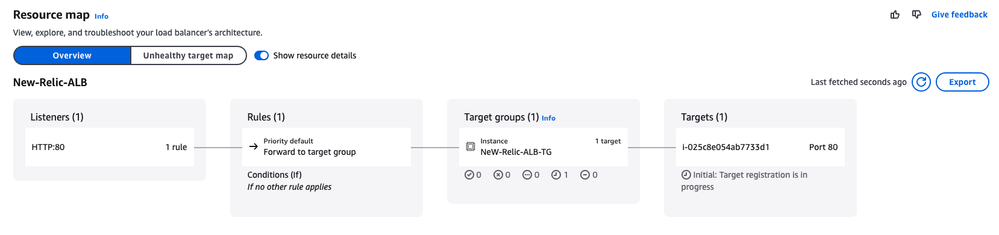
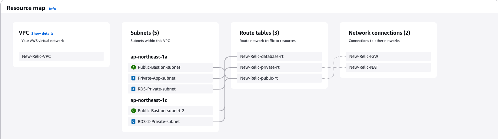
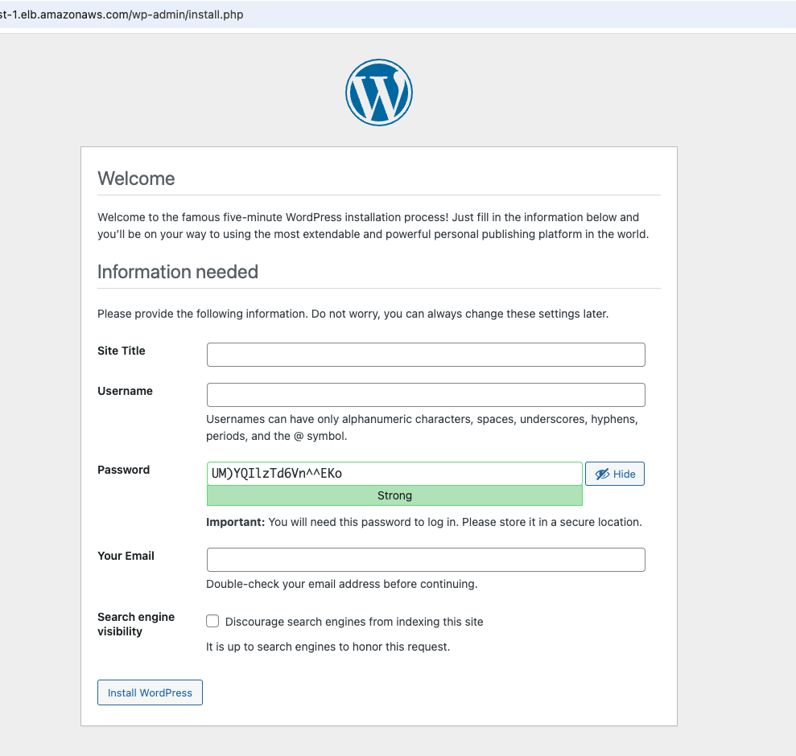
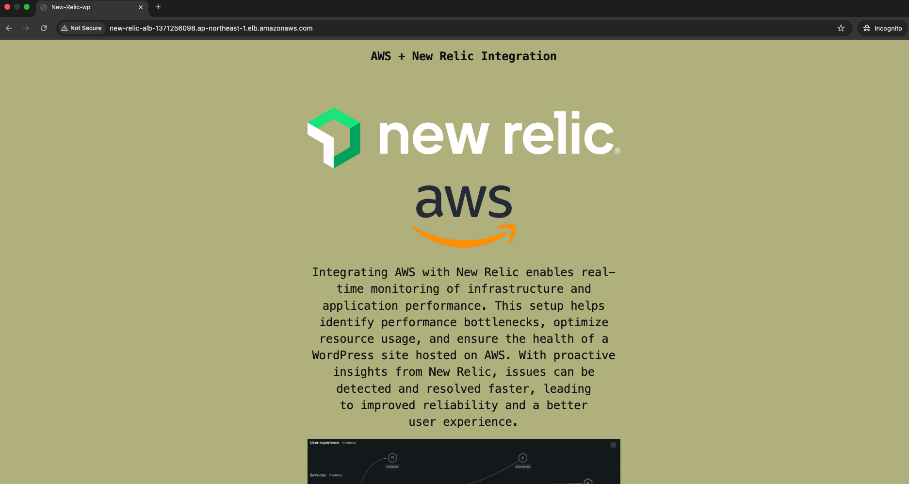

This document outlines the steps to configure the AWS VPC and network infrastructure for hosting a WordPress application. It includes setting up VPC, subnets, security groups, route tables, IGW, ALB and deploying the necessary EC2 and RDS instances.

## AWS VPC and Network Configuration

### VPC Setup
| Name              | CIDR Block   |
|------------------|-------------|
| New-Relic-VPC   | 10.0.0.0/16  |

### Subnets
| Availability Zone | Purpose       | CIDR Block    |
|------------------|--------------|--------------|
| ap-northeast-1a | Private App Server  | 10.0.1.0/24  |
| ap-northeast-1a | Private RDS         | 10.0.2.0/24  |
| ap-northeast-1a | Public Bastion Host | 10.0.0.0/24  |
| ap-northeast-1c | Public Bastion Host | 10.0.4.0/24  |
| ap-northeast-1c | Private RDS (Multi-AZ) | 10.0.3.0/24  |

### Security Groups
| Security Group | Inbound Rules | Outbound Rules |
|---------------|--------------|---------------|
| **New-Relic-Bastion-public-SG** | SSH (22) - 0.0.0.0/0, ICMP - (My IP to ping Bastion) | All traffic - 0.0.0.0/0 |
| **New-Relic-Bastion-public-2-SG** | SSH (22) - 0.0.0.0/0, ICMP - (My IP to ping Bastion) | All traffic - 0.0.0.0/0 |
| **New-Relic-App-private-SG** | SSH (22) - Bastion SG, HTTP (80) - ALB SG | All ICMP - 0.0.0.0/0 |
| **New-Relic-RDS-SG** | MySQL / Aurora (3306) - App Private SG | All ICMP - 0.0.0.0/0 |
| **New-Relic-ALB-SG** | HTTP (80) - 0.0.0.0/0 | All traffic - 0.0.0.0/0 |

## Route Tables and Gateways
- **Internet Gateway:** `New-Relic-IGW`, attached to the VPC.
- **Route Tables:**
  - Public Route Table: Public subnet (Bastion Host)10.0.0.0/24 - Routes `0.0.0.0/0` to Internet Gateway.
  - Private Route Table: Private subnet (app server) 10.0.1.0/24 - Routes `0.0.0.0/0` to NAT Gateway.
  - Private RDS Route Table: Private subnet RDS (Multi-AZ) 10.0.3.0/24 , Private subnet RDS 10.0.2.0/24.

## EC2 and RDS Deployment
### Bastion Host
- **AMI:** Amazon Linux 2 Kernel 5.10
- **Instance Type:** t2.micro
- **Security Group:** `New-Relic-Bastion-public-SG`

### Application Server (WordPress)
- **AMI:** Amazon Linux 2 Kernel 5.10
- **Instance Type:** t2.micro
- **Security Group:** `New-Relic-App-private-SG`

### RDS MySQL Database
- **Engine:** MySQL 8.0.40
- **Instance Type:** db.t3.micro
- **Security Group:** `New-Relic-RDS-SG`

## ALB Configuration
- **Target Group Type:** Instance
- **Protocol:** HTTP (80)
- **Health Check Path:** `/`
- **Registered Target:** Private EC2 instance hosting WordPress.
- ALB resource map: 

## VPC resource map
How VPC resources are mutually connected: 

## WordPress Installation
1. Connect to the private EC2 instance via SSH using the bastion host.
2. Install MariaDB and MySQL.
3. Create a `wordpress_DB`.
4. Install WordPress and configure `wp-config.php`.
5. Verify installation using `curl -I http://localhost`.
6. Check ALB DNS name in AWS Console 
7. Open `http://<alb-dns-name>/wp-admin/install.php` in a browser.

## Final Web Result

## Next Steps
- Install New Relic PHP agent on the App Server to monitor the WP site.
- 
