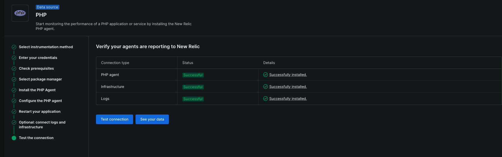

This document outlines the steps to set up and test New Relic monitoring on an AWS-hosted WordPress application. It includes agent installation, dashboard configuration, and synthetic monitoring setup (Using New Relic Free tier).

## New Relic Overview
New Relic is a powerful Full-Stack observability platform that provides real-time insights into application performance, infrastructure health, digital experience monitoring and more.
This PoC focuses on deploying a WordPress site on AWS and integrating New Relic for monitoring. The goal is to track performance, analyse application behavior, and gain insights using New Relic’s observability tools.

### **Key Features Used in This PoC:**
- **APM (Application Performance Monitoring)**
- **Infrastructure Monitoring**
- **Synthetic Monitoring**
- **Dashboarding & Alerting**

## Steps Followed

1. **Installed and Configured New Relic PHP Agent**

   - On Application monitoring, selected PHP .
   - .
   - On the App server, added New Relic repository and installed the PHP agent.
   - Connected infrastructure and logs.
   - Restarted the Apache server to apply changes. 
   - 

2. **Monitored Key Metrics in New Relic**

   - **Application Performance**: .
   - **Infrastructure Monitoring**: Analysed CPU, memory, disk I/O and network usage of the EC2 instance.
   - **Synthetic monitoring**: Since the WP site doesn't have any actual interactions, I used synthetic monitoring to ping checks that monitor uptime, page load speed and API availability from different regions .

2. **New Relic service map**
    .

## **Conclusion**
This PoC successfully demonstrates how New Relic can be integrated into an AWS-hosted WordPress application to gain real-time insights into application performance, infrastructure health, logs, uptime, and various types of telemetry. By monitoring key metrics such as response times, server resource usage, and external service calls, New Relic provides actionable data to optimize both the application and infrastructure.